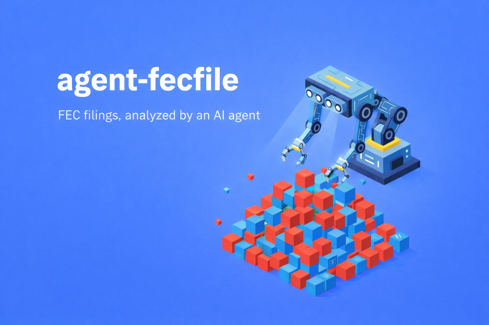

# agent-fecfile



## FEC Filing Plugin for Claude Code

A [Claude Code plugin](https://docs.anthropic.com/en/docs/claude-code/plugins) for analyzing Federal Election Commission (FEC) campaign finance filings. Includes an [Agent Skill](https://agentskills.io) and an [MCP server](https://modelcontextprotocol.io) for API access.

This plugin enables AI agents to fetch, parse, and analyze FEC filings directly within agent sessions. Parsing and filtering happen outside the model context, allowing agents to programmatically reduce large filings before analysis, saving tokens and enabling efficient queries against filings of any size.

The plugin includes detailed field mappings for common form types and schedules, helping agents accurately interpret campaign finance data like contributions, disbursements, and committee information.

## What it Does

- Automatically downloads and reads FEC filings for your AI agent.
- Lets you search for political committees and their financial reports.
- Understands major campaign finance forms (F1, F2, F3, F99).
- Accurately reads contributions, spending, and detailed schedules.

## Prerequisites for Beginners

If you're not a developer, don't worry! You can still use this tool. You'll just need a few basic things set up first.

1. **Claude Desktop or Claude Code**: This tool works perfectly in the [Claude Desktop App](https://claude.ai/download) using the "Code" tab, which gives the AI a space to run scripts. Alternatively, advanced users can use the terminal-based [Claude Code CLI](https://docs.anthropic.com/en/docs/claude-code).
2. **Python & uv**: This tool runs on Python. You must install a tool called `uv` globally from their [website](https://docs.astral.sh/uv/) (using their standard install commands). This ensures your system can find it automatically and allows Claude Desktop to run scripts in the background.
3. **An FEC API key**: (Optional but recommended) This lets you search for committees. You can get a free one from the [FEC Developers page](https://api.open.fec.gov/developers/).

## Installation

### Step 1: Install the Plugin (Recommended)

You can install this plugin either through Claude Desktop's Code tab, or directly in your terminal if you use Claude Code. Just paste the following commands:

```bash
# First, tell Claude where to find this plugin
claude plugin marketplace add hodgesmr/agent-fecfile

# Next, install the plugin
claude plugin install fecfile@agent-fecfile
```

*Note: If you're using Claude Desktop, you may need to restart the app or start a new Code session for the new features to fully load.*

**How to Update Later:**
If you need to update to a newer version in the future, run these commands:
```bash
claude plugin marketplace update agent-fecfile
claude plugin update fecfile@agent-fecfile
```

### Advanced Installation (For Developers)

For agent runtimes that support Agent Skills and MCP but not Claude Code plugins (like Codex CLI):

1. **Clone the repository:**

```bash
git clone --branch latest git@github.com:hodgesmr/agent-fecfile.git ~/agent-fecfile
```

2. **Install the Agent Skill** by symlinking to your runtime's skills directory:

```bash
# Codex CLI Global install
ln -sfn ~/agent-fecfile/skills/fecfile ~/.codex/skills/fecfile
```

3. **Configure the MCP server** using your runtime's MCP configuration:

```bash
# Codex CLI
codex mcp add fec-api -- uv run ~/agent-fecfile/mcp-server/server.py
```

> [!IMPORTANT]
> The MCP server loads the FEC API key from the system keyring on first tool use. You should expect to see a system prompt to authorize Python's access to the key the first time you use `search_committees` or `get_filings`.

**Updating:**

```bash
cd ~/agent-fecfile && git fetch --tags --force && git checkout latest
```

## Usage

Once installed, you can talk to your AI agent and ask it to analyze FEC data. Just type your questions directly into Claude Code.

> [!TIP]
> For best results, use the most capable AI models available (like Claude 3.5 Sonnet or Opus). They are much better at understanding and formatting complex financial data.

### Basic Usage (With A Filing ID)

If you already know the specific FEC filing ID (a 7-digit number found on the FEC website), you don't even need an API key. Just ask Claude about it! 

Here is an example of what you might type, and how Claude will respond:

**You type:**
```text
What are the largest expenditures in filing 1896830?
```

```text
⏺ FEC Filing 1896830 - Largest Expenditures

  | #   | Recipient                  |    Amount | Date       | Purpose          |
  |-----|----------------------------|-----------|------------|------------------|
  | 1   | Trump National Doral Hotel | $1,013.61 | 2025-05-19 | RNC training     |
  | 2   | Uber.com                   |    $19.77 | 2025-05-06 | Travel - Cabfare |
  |     | TOTAL (itemized)           | $1,033.38 |            |                  |

  Note

  Only 2 expenditures are itemized on Schedule B. The filing shows $21,283.49 in total
  disbursements, meaning most spending (~$20,250) was below the $200 itemization
  threshold and appears only in summary totals.

  The largest single itemized expense was for RNC training at Trump National Doral Hotel
  in May 2025.
```

**You type:**
```text
Show me a table of the contribution counts and totals, by state, in fec filing 1896830
```

```text
⏺ FEC Filing 1896830 - Contributions by State

  | State | Count |      Total | % of Total |
  |-------|-------|------------|------------|
  | UT    |    32 | $35,042.25 |      87.0% |
  | VA    |     2 |  $2,400.00 |       6.0% |
  | GA    |     1 |    $750.00 |       1.9% |
  | MI    |     1 |    $750.00 |       1.9% |
  | MD    |     2 |    $750.00 |       1.9% |
  | FL    |     1 |    $600.00 |       1.5% |
  | TOTAL |    39 | $40,292.25 |       100% |

  Utah dominates with 87% of the total contributions. The committee received from
  6 states total, with only 7 out-of-state contributions.
```

### FEC API Setup (For Searching)

If you want to search for a committee or filing without knowing their exact ID in advance, you'll need to set up an API key. This only takes a minute!

#### 1. Get your free API Key

1. Visit the [FEC API Developer page](https://api.open.fec.gov/developers/).
2. Fill out the short form under "Sign up for an API key".
3. You'll receive your API key in your email within seconds. Keep this email open!

#### 2. Securely Store Your API Key

We need to store this key securely on your computer so the tool can use it. The AI itself never sees your key.

**For Mac Users:**
1. Open "Keychain Access" (Press Command + Space, type "Keychain Access", and hit Enter).
2. Click `File` → `New Password Item` in the top menu bar (or press Command + N).
3. Fill in the form exactly like this:
   - **Keychain Item Name:** `fec-api`
   - **Account Name:** `api-key`
   - **Password:** *(paste the API key you got in your email)*
4. Click **Add**.

**For Windows Users:**
1. Open the Start menu, search for "Credential Manager" and open it.
2. Click on **Windows Credentials**.
3. Click **Add a generic credential**.
4. Fill in the form:
   - **Internet or network address:** `fec-api`
   - **User name:** `api-key`
   - **Password:** *(paste the API key you got in your email)*
5. Click **OK**.

### Searching For Committees and Filings

Once your API key is securely stored, you can ask Claude general questions without needing a filing ID. 

**You type:**
```text
What are the top expenditures in Utah Republican Party's most recent filing?
```

```text
⏺ Top Expenditures - Utah Republican Party (December 2025)

  Filing 1942957 | Coverage: Dec 1-31, 2025 | Total Disbursements: $20,500.65
  ┌─────────────────────────┬───────────┬────────────────────────┬────────┐
  │          Payee          │  Amount   │        Purpose         │  Date  │
  ├─────────────────────────┼───────────┼────────────────────────┼────────┤
  │ USPS                    │ $4,699.58 │ Direct Mail            │ Dec 23 │
  ├─────────────────────────┼───────────┼────────────────────────┼────────┤
  │ CPMI Solutions          │ $4,396.30 │ Direct Mailing         │ Dec 22 │
  ├─────────────────────────┼───────────┼────────────────────────┼────────┤
  │ NationBuilder           │ $2,925.00 │ Office Subscriptions   │ Dec 1  │
  ├─────────────────────────┼───────────┼────────────────────────┼────────┤
  │ NationBuilder           │ $2,646.00 │ Office Subscriptions   │ Dec 29 │
  ├─────────────────────────┼───────────┼────────────────────────┼────────┤
  │ Chartwells              │ $1,907.24 │ Event Registration Fee │ Dec 17 │
  ├─────────────────────────┼───────────┼────────────────────────┼────────┤
  │ Buckeye Premium Finance │ $1,071.48 │ Rent                   │ Dec 26 │
  ├─────────────────────────┼───────────┼────────────────────────┼────────┤
  │ Extra Space Storage     │ $487.00   │ Storage                │ Dec 2  │
  ├─────────────────────────┼───────────┼────────────────────────┼────────┤
  │ Extra Space Storage     │ $487.00   │ Storage                │ Dec 30 │
  ├─────────────────────────┼───────────┼────────────────────────┼────────┤
  │ Ring Central            │ $170.31   │ Telephone              │ Dec 11 │
  ├─────────────────────────┼───────────┼────────────────────────┼────────┤
  │ Intuit                  │ $123.57   │ Office Subscriptions   │ Dec 24 │
  └─────────────────────────┴───────────┴────────────────────────┴────────┘
  The bulk of December spending was on direct mail operations (~$9,100 combined
  to USPS and CPMI Solutions) and NationBuilder software subscriptions (~$5,600).
```

## Project Structure

```
agent-fecfile/
├── .claude-plugin/
│   ├── plugin.json              # Plugin manifest (version source of truth)
│   └── marketplace.json         # Marketplace catalog for plugin distribution
├── .mcp.json                    # MCP server configuration
├── mcp-server/
│   └── server.py                # MCP server (authenticated FEC API)
├── skills/fecfile/
│   ├── SKILL.md                 # Agent Skill instructions
│   ├── references/              # Form and schedule documentation
│   │   ├── FORMS.md             # Reference for FEC form types (F1, F2, F3, F99)
│   │   └── SCHEDULES.md         # Field mappings for Schedules A, B, C, D, E
│   └── scripts/
│       └── fetch_filing.py      # Fetches FEC filing data (public API)
├── README.md                    # Installation and usage for end users
├── CHANGELOG.md                 # Version history
└── release.sh                   # Automated release script
```

The MCP server:
- Loads the FEC API key from keyring **on first tool use** (not at startup)
- Holds the key in memory, never exposing it to the model
- Provides `search_committees` and `get_filings` tools

## Security Notes

- **Network access**: This plugin requires network access to fetch data from the FEC (`docquery.fec.gov`, `api.open.fec.gov`). It will not work in environments where external network access is restricted.

- **Untrusted content**: FEC filings should be considered [untrusted content](https://simonwillison.net/2025/Jun/16/the-lethal-trifecta/). A malicious campaign sneaking prompt injections into the memo text field of their F99 is probably unlikely, but not impossible.

- **Keyring access**: The MCP server accesses the keyring **on first tool use**. You should expect a system prompt (e.g., "Python wants to access your keychain") when your agent first calls the MCP server. This is normal. The key is held in the MCP server's memory for the session duration. You should **not** see keyring prompts at any other time; if you do, investigate.

## Acknowledgments

- Built on the excellent [fecfile](https://github.com/esonderegger/fecfile) library by Evan Sonderegger
- Inspired by Derek Willis's [llm-fecfile](https://github.com/dwillis/llm-fecfile) LLM plugin
- Uses data from the Federal Election Commission

## License

[MIT License](./LICENSE)
